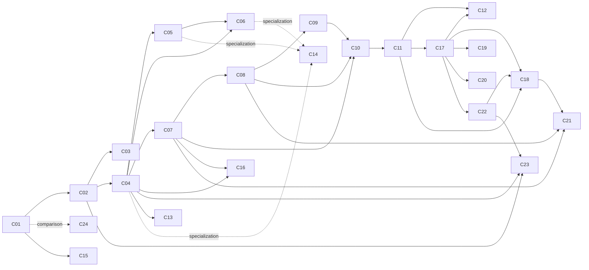

# Claim dependency graph and proof ledger

This historical document records the former directed proof graph.  Current
completion and review information is maintained in [STATUS.md](../../STATUS.md).
For every claim it records the exact quantifiers, internal lemmas, division
between executable and written proof, external inputs, and remaining proof or
audit obligations.

An arrow `Ci -> Cj` means that the proof of `Cj` uses a theorem or construction
established in `Ci`.  It does not mean that every result in `Ci` is needed.
Dashed arrows mark specialization or regression relationships rather than
logical proof dependencies.

## Graph

The requested architectural spine is

\[
 \mathrm{C01}\longrightarrow \mathrm{C02--C04}
 \longrightarrow \mathrm{C05--C11}
 \longrightarrow \mathrm{C12,C16--C20}.
\]

The literal claim-level DAG has four side branches: C13 comes from the
universal monodromy theorem C04, C14 is the explicit quartic specialization,
C15 comes directly from C01 through stable-reduction theorems, and C24 is the
independent cancellation master construction whose first member recovers C01
up to linear equivalence.

The edge `C17 -> C12` means that C12 uses the same two-transfer block proved
uniformly in C17.  Historically the degree-twelve calculation came first;
logically it is cleanest to regard the reusable `Z_2` theorem as a lemma for
C12.  C19 and C20 use the definition and Gröbner strategy of C17, not its
rank-four conclusion.

C21 is the target-side master quotient theorem. It uses C07 for the
full-contact/omission interpretation, C08 for the coincident-root strata, C22
for the full Boolean local relation, and C18 for the arbitrary global
Wronskian equalizer. C17--C20 are independent coordinate regressions for the
local factors.

## Evidence terminology

- **Computation** means exact symbolic arithmetic, elimination, Gröbner-basis
  verification, or a generated finite artifact.  A bounded computation is
  never counted as proving an all-degree quantifier.
- **Prose** means a conventional written mathematical proof in the linked
  note.  It is not a proof-assistant derivation.
- **External theorem** means a result whose proof is not reproduced here.
- **Obligation** distinguishes a possible gap in the stated proof from a
  desirable independent audit or a stronger theorem outside the claim.

## C01 — explicit counterexample

**Quantified statement.**  Over every characteristic-zero field containing
the displayed rational coefficients, the polynomial map

\[
F=(u^3z+y^2u(4+3xy),\ y+3xu^2z+3xy^2(4+3xy),\
2x-3x^2y-x^3z),\qquad u=1+xy,
\]

has `det DF=-2` and maps the three distinct points

\[
(0,0,-1/4),\quad(1,-3/2,13/2),\quad(-1,3/2,13/2)
\]

to `(-1/4,0,0)`.  Hence it is a noninjective Keller map and disproves the
Jacobian conjecture in dimension three; adjoining identity coordinates gives
a counterexample in every dimension `N>=3`.

**Depends on.**  Direct determinant expansion; exact substitution; the
elementary lemma that a polynomial automorphism is injective.

**Computation.**  `verify_counterexample.py` and the dependency-free
`verify_counterexample_independent.py` independently establish the
determinant, collision, distinctness, and coordinate degrees.  Dean Cureton's
pinned Lean 4 project formally establishes the determinant, collisions,
determinant-one rescaling, and complex specialization.

**Prose.**  [FOUNDATIONAL_GEOMETRY.md](../../verified/FOUNDATIONAL_GEOMETRY.md) gives the
structural determinant proof and collision; [README §1](../../README.md#1-geometric-construction-and-explicit-map)
identifies the geometric etale map and gives the implications to dimensions
`N>=3`.

**External theorems.**  None beyond definitions for the local certificate.
The optional Lean replication uses Lean/mathlib and remains Dean Cureton's
separately authored work; see [LEAN_C01.md](../../verified/LEAN_C01.md).

**Obligations.**  No known internal proof gap.  A third unrelated CAS audit
and an archival clean-machine reproduction remain desirable.

## C02 — symmetric-product construction and marked-root reconstruction

**Quantified statement.**  Let

\[
\pi:\mathbb P^1\times\operatorname{Sym}^2(\mathbb P^1)
\longrightarrow\operatorname{Sym}^3(\mathbb P^1)
\]

be addition of effective divisors, let `R` be its ramification divisor, and
let `H` be a hyperplane tangent but not osculating to the small diagonal.
Then the complements

\[
X=(\mathbb P^1\times\operatorname{Sym}^2(\mathbb P^1))
\setminus(R\cup\pi^{-1}(H)),\qquad
Y=\operatorname{Sym}^3(\mathbb P^1)\setminus H
\]

are both affine three-spaces, and `pi|X:X -> Y` is the displayed etale,
generically three-to-one map.  Equivalently, the affine source is the
simple-root locus of

\[
cU^3-2U^2V+bUV^2-2aV^3=0
\]

with one projective root marked, including the root chart at infinity.  Under
this isomorphism `F` forgets the marked root.  On the affine-root chart
`t=y+1/x`, the inverse polynomial is

\[
P(T)=cT^3-2T^2+bT-2a,
\]

the displayed rational formulas reconstruct `(x,y,z)` from a simple root,
the generic degree is three, and `Disc_T(P)=-4Q` with

\[
Q=27a^2c^2-18abc+16a+b^3c-b^2.
\]

**Depends on.**  The standard binary-form model of `Sym^3(P^1)`; C01's
coordinate map; the marked-root identities; the two reconstruction charts;
`P'(t)=2/x`; finite simple-root incidence.

**Computation.**  `verify_marked_root_model.py`, `cubic_model.py`, and
`verify_counterexample.py` check both charts, incidence, inverse formulas,
generic degree certificate, and discriminant identity.

**Prose.**  [FOUNDATIONAL_GEOMETRY.md](../../verified/FOUNDATIONAL_GEOMETRY.md) and
[MARKED_ROOT_MODEL.md](../../verified/MARKED_ROOT_MODEL.md) prove the global two-chart
incidence isomorphism and explain why denominator clearing loses no root
chart. [README §1](../../README.md#1-geometric-construction-and-explicit-map)
states the intrinsic construction; [FACTS.md](../core-support/FACTS.md#function-field-model)
proves the function-field degree argument.

**External theorems.**  Standard identifications `Sym^d(P^1) ~= P^d` and of
the ramification of the marked-root cover with the repeated-marked-root locus.

**Obligations.**  No independent second-CAS or proof-assistant audit of the
incidence isomorphism.

## C03 — exact cubic image and nonproperness

**Quantified statement.**  Over `C`, with `Q` as above and

\[
\Gamma=V(3bc-4,\ 12a-b^2),
\]

one has

\[
F(\mathbb C^3)=\mathbb C^3\setminus\Gamma,
\qquad S_F=V(Q).
\]

The geometric fiber cardinality is `3` on `Q ne 0`, `1` on
`V(Q)\setminus\Gamma`, and `0` on `Gamma`; the generic cubic monodromy is
`S_3`.

**Depends on.**  C02; the cubic root-type trichotomy; the finite and
root-at-infinity reconstruction charts; explicit escaping paths; local
transposition around the discriminant.

**Computation.**  The marked-root, exceptional-fiber, image-inclusion, and
escaping-path scripts prove the algebraic inclusions and representative local
identities exactly.

**Prose.**  [FOUNDATIONAL_GEOMETRY.md](../../verified/FOUNDATIONAL_GEOMETRY.md) gives the
root-chart proof spine; [IMAGE_AND_NONPROPERNESS.md](../../verified/IMAGE_AND_NONPROPERNESS.md)
proves the two image inclusions, both nonproperness inclusions, properness off
`V(Q)`, and the explicit `S_3` loops.

**External theorems.**  Standard covering-space interpretation of a smooth
discriminant meridian.

**Obligations.**  Independent audit of irreducibility, normalization, and the
topological monodromy step remains pending.

## C04 — universal weighted marked-root theorem

**Quantified statement.**  Let `k` have characteristic zero, let `n>=3`, and
let `H in k[W]` have degree `n` with

\[
H(0)=H(1)=0,\quad H'(0)=0,\quad H'(1)=-c\ne0,
\quad H''(1)/c\ne-2.
\]

For the associated weighted Keller map `G_H`, the finite incidence

\[
E_{A,B,C}(W)=H(W)-BCW+cAC^2=0
\]

has a normalization whose regular-reconstruction open is isomorphic to
`A^3`; on `C ne 0` this open is exactly the simple-root locus.  More generally,
for every degree-`n` polynomial `H`, `H(W)-sW+t` is irreducible over
`k(s,t)`, its repeated-root discriminant is irreducible and birationally
normalized by `(H'(r),rH'(r)-H(r))`, and its geometric and arithmetic
monodromy groups are `S_n`.

**Depends on.**  C02 as the motivating marked-root model; polynomiality and
constant-Jacobian identities for the weighted lift; Gauss irreducibility;
coprime pole orders `n-1,n`; generic double-root transposition; connected
transposition graph; regular reconstruction on every normalized boundary
chart.

**Computation.**  `verify_weighted_seed_schema.py`,
`verify_weighted_seed_theorem.py`, and
`verify_weighted_marked_root_model.py` check the universal polynomiality
cancellation, structural determinant, reconstruction identities,
normalization formulas, primitivity, and local charts.  Fixed seeds through
bounded degree are regressions only.
`audit_c04_independent.py` separately checks polynomiality, Jacobians,
incidence, and reconstruction using only standard-library sparse-polynomial
arithmetic and no project weighted-model code.

**Prose.**  [FOUNDATIONAL_GEOMETRY.md](../../verified/FOUNDATIONAL_GEOMETRY.md) collects the
independent proof spine; [WEIGHTED_SEED_THEOREM.md](../../verified/WEIGHTED_SEED_THEOREM.md)
proves the uniform pencil and algebraic monodromy theorem; and
[WEIGHTED_MARKED_ROOT_MODEL.md](../core-support/WEIGHTED_MARKED_ROOT_MODEL.md) proves the
normalized global reconstruction statement.
[C04_INDEPENDENT_AUDIT.md](../core-support/C04_INDEPENDENT_AUDIT.md) gives a
clean-room derivation and an alternative vertical-line branch-cycle proof of
`S_n`.

**External theorems.**  Gauss's lemma, normalization and Zariski's Main
Theorem, Zariski--Nagata purity, and triviality of finite etale covers of
affine space over an algebraically closed characteristic-zero field.

**Obligations.**  A proof-assistant artifact is still absent, but the
all-degree proof now has an independent second derivation and implementation.

## C05 — generic discriminant geometry

**Quantified statement.**  For every `n>=3` over an algebraically closed
characteristic-zero field, there is a nonempty Zariski-open subset of the
normalized admissible degree-`n` seed space such that the projective
discriminant curve has degree `n`, normalization `P^1`, one smooth point at
infinity, exactly `n-2` ordinary cusps and
`(n-2)(n-3)/2` ordinary nodes, and no other singularities.

**Depends on.**  C04's discriminant normalization; projective extension of
the tangent-line map; the compactified `(4)`, `(3,2)`, and `(2,2,2)` bad
incidences; exhaustion of bad normalization branches by those contact
patterns; the complete infinity-boundary classification; dimension
preservation under graph closure; the irreducible divided tangent-chord
bundle meeting the admissible slice; genus formula.

**Computation.**  `verify_universal_discriminant_incidences.py` and
`verify_generic_discriminant_geometry.py` check the universal contact
identities, homogeneous graph formulas, compactified source dimensions,
affine-bundle identity, admissible witness, and exact examples through degree
ten.  The examples do not prove genericity in all degrees.

**Prose.**  [GENERIC_DISCRIMINANT_CURVE.md](../../extended-geometry/GENERIC_DISCRIMINANT_CURVE.md)
proves compactification, exhaustion, all infinity degenerations, closure
dimension, nonempty good open, and the genus count.

**External theorems.**  Proper morphisms have closed image; proper
locally-quasi-finite morphisms of curves are finite; standard normalization
facts; the plane-curve arithmetic-genus formula; ordinary nodes and cusps
have delta invariant one.

**Obligations.**  The all-degree proof is internal and no longer depends on a
generic projective-duality theorem.  An independent algebraic-geometry audit
of the graph-closure and relative-infinity arguments remains desirable.

## C06 — image and boundary theorems for weighted families

**Quantified statement.**  For every `d>=2`, the canonical map defined by
`H_d=W^d(1-W)` has generic degree `d+1`.  Its only omitted pencil values are
`(s,t)=(1/3,1/27)` for `d=2` and `(1/8,-1/64)` for `d=3`; for `d>=4` it is
surjective.  Its nonproperness set is `V(Q_2)` when `d=2` and
`V(C) union V(Q_d)` when `d>=3`, where
`Disc(H_d-BCW+AC^2)=C^dQ_d`.  On `C=0`, the fiber sizes are `3/1` off/on
`B^2=4A` for `d=2`, and `2/1` according as `B ne 0` or `B=0` for `d>=3`.

For the one-extra-root family

\[
H_\rho={c\over1-\rho}W^2(1-W)(W-\rho),
\qquad \rho\notin\{0,1,2\},
\]

the unique omitted value is
`(c(1-rho^2)/8,-c(1-rho)^3/64)`, with the stated double-double factorization,
and `V(C)` is a nonproperness component.  More generally, for every
admissible root profile

\[
H=hW^{m_0}(W-1)\prod_j(W-\rho_j)^{\mu_j},
\]

the exact saturation exponent is
`e=m_0+sum_j(mu_j-1)`, so `Disc(E)=C^eQ_H` with `C` not dividing `Q_H`; the
boundary trace, finite `C=0` fibers, escaping rates, image complement given by
the finite omitted set `Omega_H`, and nonproperness set
`V(C) union V(Q_H)` outside the minimal cubic case are those displayed in the
root-profile theorem.  Finally, a generic admissible seed of every inverse
degree `n>=5` is surjective.

**Depends on.**  C04 reconstruction and étaleness; C05 for generic
surjectivity; exact discriminant saturation; direct `x=0` and `gamma=0`
charts; full-contact/no-simple-root criterion; root-cluster valuations.

**Computation.**  Uniform polynomial, discriminant-saturation, and boundary
identities are exact.  Canonical, deformed, repeated-root, and quartic scripts
check bounded instances and nonsplit factors; those are regressions for the
uniform family statements.

**Prose.**  [CANONICAL_FAMILY_IMAGE.md](../../extended-geometry/CANONICAL_FAMILY_IMAGE.md),
[DEFORMED_SEED_BOUNDARY.md](../geometry-support/DEFORMED_SEED_BOUNDARY.md), and
[REPEATED_ROOT_BOUNDARY.md](../geometry-support/REPEATED_ROOT_BOUNDARY.md) prove the lacunary
factor classification, direct boundary fibers, valuation formula, and both
image/nonproperness inclusions.

**External theorems.**  Standard valuative criterion for properness and
elementary Newton-polygon/étale separation facts.

**Obligations.**  Independent audit of the uniform boundary valuation and
properness arguments remains pending.  The claim does not assert one formula
without the individual family hypotheses.

## C07 — full-contact and unique omission

**Quantified statement.**  For every normalized admissible degree-`n` seed,
`n>=3`, over an algebraically closed characteristic-zero field, an inverse
pencil value `(s,t)` is omitted exactly when every root of
`H(W)-sW+t` has multiplicity at least two.  Every such seed has at most one
omitted `(s,t)`.

**Depends on.**  C04 reconstruction; complete multiplicity factor matching;
pairwise coprimality of two distinct omitted polynomials; the polynomial
Mason--Stothers inequality; the all-double difference-of-squares endpoint.

**Computation.**  `verify_omitted_value_classification.py` checks the exact
classifier; `verify_unique_omitted_value.py` checks support and endpoint
identities.  Mason alternatives through degree 24 are regression tests.

**Prose.**  [OMITTED_VALUE_CLASSIFICATION.md](../../extended-geometry/OMITTED_VALUE_CLASSIFICATION.md)
proves exhaustiveness of factor matching;
[UNIQUE_OMITTED_VALUE.md](../geometry-support/UNIQUE_OMITTED_VALUE.md) proves separation and the
remaining all-double case.

**External theorems.**  Polynomial Mason--Stothers.

**Obligations.**  Independent primary-source and hypothesis audit of the
Mason application remains pending.

## C08 — full-contact strata and dimensions

**Quantified statement.**  For every `n>=3` and every partition
`lambda=(lambda_1,...,lambda_ell)` of `n` with all `lambda_i>=2`, the exact
full-contact locus `E_lambda` in normalized admissible seed space is locally
closed and nonempty; the non-surjective locus is the disjoint union of all
`E_lambda`; and every stratum has

\[
\dim E_\lambda=\ell-1,
\qquad \operatorname{codim}_{\mathcal A_n}E_\lambda=n-\ell-2.
\]

**Depends on.**  C07; the root hypersurface `Phi_lambda=0`; nonemptiness of
its admissible open; quotient by permutations of equal parts; the weighted
Newton/Vandermonde determinant proving that projection to seed coefficients
has rank `ell-1`.

**Computation.**  Incidence APIs, equal-part quotients, the weighted
Vandermonde identity, and eliminations in degrees five through eight are
checked exactly.  The new Macaulay2 comparison is an independent bounded
audit, not an all-degree proof.

**Prose.**  [COINCIDENT_ROOT_REBUILD.md](../../extended-geometry/COINCIDENT_ROOT_REBUILD.md) proves
nonemptiness by splitting an admissible maximally collided polynomial,
finiteness by weighted Newton coordinates, and the exact dimension formula.
[CONTACT_PARTITION_STRATA.md](../geometry-support/CONTACT_PARTITION_STRATA.md) and
[UNIFORM_EXCEPTIONAL_SEEDS.md](../geometry-support/UNIFORM_EXCEPTIONAL_SEEDS.md) retain the
incidence API and original formulation.

**External theorems.**  Finite group quotients, the homogeneous base-locus
criterion for finiteness, principal-divisor dimension, and the formal
implicit-function theorem.

**Obligations.**  Independent audit of the all-degree quotient and
weighted-Vandermonde projection argument remains pending.

## C09 — contact atoms

**Quantified statement.**  If reconstruction retains roots of multiplicity
strictly below a threshold `r>=2`, then the allowed omitted contact semigroup
is `{r,r+1,...}` and its indecomposable nonzero elements are exactly
`{r,...,2r-1}`.  For the repository's threshold `r=2`, maximal refinements
therefore use only parts `2` and `3`; a type `2^a3^b`, `2a+3b=n`, has dimension
`a+b-1`, and every part at least four is a collision boundary of such a
refinement.

**Depends on.**  C08's dimension formula and collision interpretation;
elementary numerical-semigroup decomposition; the excess identity.  Mason is
used only for separation of distinct types, not atom selection.

**Computation.**  `verify_contact_atom_principle.py` checks semigroup atoms,
excess identities, threshold-`r` formulas, and bounded enumerations.

**Prose.**  [CONTACT_ATOM_PRINCIPLE.md](../../extended-geometry/CONTACT_ATOM_PRINCIPLE.md) gives the
uniform semigroup and dimension-optimization proof.

**External theorems.**  Mason--Stothers only for the subsequent separation
statement inherited by C10.

**Obligations.**  No known internal gap; independent review is pending.  The
threshold-`r` statement is abstract and does not assert that a weighted map
realizing every threshold has been constructed.

## C10 — exceptional components and closure order

**Quantified statement.**  For every `n>=3`, the irreducible components of the
closure of the exceptional locus in normalized admissible seed space are
indexed by all solutions `n=2a+3b`.  The component `C_(a,b)` has dimension
`a+b-1`; the total exceptional codimension is `ceil(n/2)-2`; the number of
components is the coefficient of `z^n` in
`1/((1-z^2)(1-z^3))`.  For full-contact partitions, closure order is exactly
coarsening by merging parts, and set-theoretic intersections of component
closures are exactly the union of their common coarsening strata.

**Depends on.**  C07 uniqueness and Mason separation; C08 dimensions and
finite root quotients; C09 atom/maximal-refinement theorem; tangent-chord
root-splitting deformation; irreducibility of every maximal
`Phi_(2^a3^b)`; recovery of top coefficients by weighted Newton sums.

**Computation.**  The collision-order API, seven endpoint irreducibility
certificates, component counts, and exact degree-six/eight intersections are
checked.  Bounded Mason scans are regressions only.

**Prose.**  [COINCIDENT_ROOT_REBUILD.md](../../extended-geometry/COINCIDENT_ROOT_REBUILD.md) derives
both directions of the closure order from finite coincident-root
normalizations, proves maximal irreducibility, and derives intersections from
unique omission.  [UNIFORM_EXCEPTIONAL_SEEDS.md](../geometry-support/UNIFORM_EXCEPTIONAL_SEEDS.md)
contains the endpoint details and original component formulas.

**External theorems.**  Polynomial Mason--Stothers and standard finite
morphism/irreducible-image facts.

**Obligations.**  Independent audit remains pending.  Scheme-theoretic
intersections, embedded components, and collision multiplicities are a
strictly stronger open problem, not part of this set-theoretic claim.

## C11 — component normalizations

**Quantified statement.**  For every `a,b>=0` with `n=2a+3b>=3`, let

\[
M=Q^2R^3,\quad \Phi=M(1)-M(0)-M'(0),\quad
D=M'(1)-M'(0),
\]

with `Q,R` monic of degrees `a,b`, `Phi=0`, `D ne 0`, and
`M''(1)-2D ne 0`.  The resulting smooth quotient hypersurface maps finitely
and birationally to `C_(a,b)` by

\[
H=(-M+M'(0)W+M(0))/D
\]

and is its normalization.  Over the generic exact collision type
`nu=(m_1,...,m_k)`, its fiber is the set of allocations
`2i_rho+3j_rho=m_rho` with totals `(a,b)`, counted by the coefficient formula
in [COMPONENT_NORMALIZATION.md](../../extended-geometry/COMPONENT_NORMALIZATION.md).

**Depends on.**  C10's irreducible components; universal endpoint derivative
for smoothness; seven low endpoint cases; finiteness of the weighted Newton
map; unique factorization for generic degree one; allocation factorization at
each collision root.

**Computation.**  `verify_component_normalization.py` checks stable
derivatives, seven saturated singular ideals, finiteness identities,
degree-one behavior, and allocation counts.

**Prose.**  [COINCIDENT_ROOT_REBUILD.md](../../extended-geometry/COINCIDENT_ROOT_REBUILD.md) gives the
finite-normalization proof in the common coincident-root framework;
[COMPONENT_NORMALIZATION.md](../../extended-geometry/COMPONENT_NORMALIZATION.md) proves smoothness,
normality, finiteness, birationality, and the allocation formula in detail.

**External theorems.**  A finite birational morphism from a normal integral
scheme is the normalization; standard symmetric-polynomial finiteness.

**Obligations.**  Independent normalization audit remains pending.
Ramification divisors, conductors, and nongeneric branch multiplicities are
stronger unresolved questions.

## C12 — generic degree-twelve local singularity

**Quantified statement.**  Over a characteristic-zero field, on a dense open
of the exact degree-twelve stratum `E_(6,6)` inside `C_(3,2)`, the two
normalization sheets have completed rings
`B_+=k[[t,x,y,z]]` and `B_-=k[[t,x',y',z']]`, and the completed component ring
is

\[
B_+\times_D B_-,\qquad
D=k[[t,\epsilon,\eta]]/(\epsilon^2,\eta^2).
\]

The quotient kernels are `(z,x^2,y^2)` and `(z',x'^2,y'^2)`, the conductor is
their direct sum, and a transverse slice has length four.  Hence the two
branches are generically quadratically tangent, not nodal.

**Depends on.**  C11's two allocation sheets over `(6,6)`; C17's local `Z_2`
block at each sixfold root; smoothness of `Phi` in one root-position
direction; affine-difference equations adding no structure; the
two-minimal-prime fiber-product lemma.

**Computation.**  `verify_degree12_branch_intersection.py` checks the rational
admissible witness, differential ranks, second jets, local Gröbner bases,
affine-equality reduction, and the upper/lower length-four sandwich.
`audit_c12_independent.py` replaces the sixfold-block Groebner step by an
elementary triangular ideal proof and independently checks the two square
directions and length-four algebra using only rational arithmetic.

**Prose.**  [DEGREE12_LOCAL_SINGULARITY.md](../../extended-geometry/DEGREE12_LOCAL_SINGULARITY.md)
passes from those finite calculations to completed local rings, identifies
the fiber product, and computes the conductor.

**External theorems.**  Excellence/reduced completion, formal implicit
function theorem, and standard two-minimal-prime fiber-product facts.

**Obligations.**  An unrelated-CAS reproduction of the full tangent-rank
matrices remains desirable; the theorem is only generic along the stated
dense open.

## C13 — finite-field Chebotarev law

**Quantified statement.**  Let `H` be a fixed characteristic-zero admissible
degree-`n` seed over a number field.  Form the explicit ideal `B_H` from its
coefficient denominators, `n!`, leading coefficient, Jacobian constants, and
the discriminants/resultants of its squarefree multiplicity factors.  At
every prime outside `B_H`, for every residue-field power `q` and every `j`,
geometric and arithmetic monodromy are `S_n`, and

\[
N_j(q)=\frac{\binom njD_{n-j}}{n!}q^3+O_H(q^{5/2}),
\]

with an explicit error obtained from `delta_n=n^n(binomial(n,2)+1)` and the
Cafure--Matera bound when `q>6delta_n^2`.  Exactly,
`N_j=(q-1)(C_j+D_j)+B_j`, with `sum B_j=q^2`, `B_0=0`, and
`sum jB_j=2q^2-q`.

**Depends on.**  C04's irreducible incidence and birational discriminant
normalization; tame transposition inertia; prime-to-characteristic purity of
affine space; simple-root reconstruction; Frobenius/factorization type; the
bijection `(A,B)->(BC,cAC^2)` for `C!=0`; the exact source divisor
`x gamma=0`.

**Computation.**  `verify_effective_chebotarev.py` computes certificate
integers and discriminant degrees, checks the branch derivative, and verifies
the exact full/pencil/boundary decomposition in degrees three and four.
`verify_weighted_chebotarev.py` retains permutation and sample regressions.

**Prose.**  [FINITE_FIELD_CHEBOTAREV.md](../../extended-geometry/FINITE_FIELD_CHEBOTAREV.md) constructs
`B_H`, proves monodromy preservation, audits every twist hypothesis, derives
the explicit error, and separates the exact discriminant and `C=0` terms.

**External theorems.**  Prime-to-`p` purity/triviality for affine space;
Meagher's twisted-variety Chebotarev identity; Cafure--Matera's explicit
Lang--Weil estimate; elementary resultant specialization.

**Obligations.**  The uniform degree constant is intentionally coarse, and an
independent arithmetic-geometry audit remains pending.  Individual `C=0`
histograms are seed-dependent, though their definition, computation, total,
zeroth entry and first moment are exact.

## C14 — explicit quartic weighted model

**Quantified statement.**  For the single quartic weighted map displayed in
[QUARTIC_WEIGHTED_GEOMETRY.md](../../extended-geometry/QUARTIC_WEIGHTED_GEOMETRY.md), over
characteristic zero, the determinant is `-6`, the inverse cover has geometric
and arithmetic monodromy `S_4`, its discriminant has exactly two ordinary
cusps and one ordinary node, and its image, fiber cardinalities, singular
locus, and nonproperness set are exactly the displayed equations and tables.

**Depends on.**  The explicit quartic formulas.  It specializes the C04
inverse/monodromy framework and the C05--C06 geometric predictions, but its
exact algebraic certificate does not logically require their all-degree
proofs.

**Computation.**  The complete quartic script suite proves polynomiality,
determinant, reconstruction, discriminant factorization and singularities,
fiber tables, both nonproperness inclusions, properness converse, and
monodromy.
`audit_c14_independent.py` separately reconstructs the map, Jacobian,
incidence, discriminant normalization, and key fiber identities with a
dependency-free sparse-polynomial implementation.

**Prose.**  [QUARTIC_WEIGHTED_GEOMETRY.md](../../extended-geometry/QUARTIC_WEIGHTED_GEOMETRY.md)
organizes the exact computations into the global image and boundary proof.

**External theorems.**  None for the finite polynomial identities; only
standard interpretations of the resulting exact cover data.

**Obligations.**  An unrelated-CAS reproduction of the singular-locus radical
and every formal escape path remains desirable.

## C15 — stable normal-form consequences

**Quantified statement.**  Over characteristic zero, the C01 map admits an
explicit stable--Segre-equivalent 95-dimensional determinant-one map `I+H`
with `H` cubic homogeneous and a GZ-paired, polynomially stable-equivalent
451-dimensional Drużkowski map `X-(AX)^{*3}`.  The stored rational source
pairs are distinct, have common images, and are transported from C01.  The
construction also gives the explicit consequences in `C15_INDEPENDENT_AUDIT.md`.

**Depends on.**  C01; the explicit homogenization/stable-equivalence steps;
the Gorni--Zampieri pairing and collision transport.

**Computation.**  `make verify-derived` generates and verifies both artifacts,
then regenerates them with a standard-library sparse-polynomial implementation
independent of SymPy.  It checks `rank(B_0)=59`, the minimal 36-column
complement, all pairing identities and collisions, and generates the explicit
consequence artifact.

**Prose.**  [CUBIC_HOMOGENEOUS_REDUCTION.md](../derived-constructions/CUBIC_HOMOGENEOUS_REDUCTION.md)
and [CUBIC_LINEAR_REDUCTION.md](../derived-constructions/CUBIC_LINEAR_REDUCTION.md) document each
transformation and the dimension counts.  [C15_INDEPENDENT_AUDIT.md](../../extended-geometry/C15_INDEPENDENT_AUDIT.md)
audits the hypotheses and consequences.

**External theorems.**  Campbell Theorems 4--5, Gorni--Zampieri Propositions
2.1 and 2.4, Zhao Theorem 7.2, and van den Essen--Wright--Zhao Theorem 3.3.

**Obligations.**  No minimality is known beyond the fixed `B_0`; the least
exceptional Vanishing/Image exponent is not computed.  A clean-checkout
archival reproduction log remains desirable.

## C16 — dicritical boundary divisors

**Quantified statement.**  For every admissible characteristic-zero seed
`H` with root profile

\[
H=hW^{m_0}(W-1)\prod_j(W-\rho_j)^{\mu_j},
\]

the reconstruction map is resolved by the normalization of the blow-up of
its four-generator homogeneous base ideal.  Etale-locally at a nonzero root
of multiplicity `mu_j` the model is `Cb=q^(mu_j)`; at zero, blowing up
`(C,W)` leaves `Tb'=q^(m_0-2)`.  Their minimal transverse `A`-chains have the
displayed valuations, discrepancies and intersections.  The dicritical
strict divisors have residue degree one over `C=0` and ramification indices
`mu_j` and `m_0-1`, respectively.  There are no other dicritical primes.
Their images give the nonproperness set; an omitted value is one for which the
discriminant divisor exhausts the inverse fiber.

**Depends on.**  C04 normalized marked-root incidence and reconstruction
poles; C07 no-simple-root characterization; graph normalization; Kummer
valuations at every root cluster; finite `x=0` and `gamma=0` charts; absence
of a root at projective infinity.

**Computation.**  `verify_weighted_marked_root_model.py` checks the
finite/escaping split; `verify_dicritical_divisors.py` checks the universal
discriminant map and Kummer leading terms; `verify_c16_blowup_geometry.py`
checks the graph coordinates, both zero-cluster blow-up charts, toric
relations and reconstruction valuations through multiplicity nineteen.

**Prose.**  [DICRITICAL_COMPACTIFICATION.md](../../extended-geometry/DICRITICAL_COMPACTIFICATION.md)
proves exhaustiveness by valuations and applies the valuative criterion.
[C16_BLOWUP_GEOMETRY.md](../geometry-support/C16_BLOWUP_GEOMETRY.md) gives the centers, four graph
charts, local toric charts, exceptional divisors, discrepancies, dual graphs,
target images and the precise minimality statement.

**External theorems.**  Universal property of blowing up and normalization,
minimal resolution of `A_n` surface singularities, hypersurface adjunction,
and the valuative criterion for properness.

**Obligations.**  Independent birational-geometry audit remains pending.  A
global MMP-minimal smooth threefold resolution is neither canonical nor
needed; the claim is the minimal normal graph and the minimal transverse
surface resolutions.

## C17 — the two-transfer cusp block

**Quantified statement.**  Over characteristic zero, complete the scheme of
monic `U,V` of degrees six and four satisfying `U^2=V^3` along
`(U,V)=(S^3,S^2)` with `S=Z^2+pZ+q`.  It is

\[
\operatorname{Spec}k[p,q,X,Y]/
(X^3,\ 2XY-pX^2,\ Y^2-qX^2),
\]

finite flat of rank four over `k[p,q]`.  Allowing `U^2-V^3` to be affine
produces the same scheme.  At `p=q=0` the transverse algebra is
`k[X,Y]/(X^3,XY,Y^2)`, of Hilbert function `(1,2,1)` and socle dimension two.

**Depends on.**  C11's local allocation/factorization interpretation for its
geometric role; triangular elimination of the coefficients of `U`; the
displayed monic relative Gröbner basis.

**Computation.**  `classify_transfer_block_k2.py` performs two-way ideal
containment, triangular elimination, comparison with the affine-difference
ideal, standard-monomial enumeration, and special-fiber socle calculation.

**Prose.**  [TRANSFER_BLOCKS.md](../transfer-program/three-four-transfer-computations.md) identifies the free basis
`1,X,Y,X^2` and applies the relative Gröbner criterion.

**External theorems.**  Standard monic relative Gröbner-basis freeness
criterion.

**Obligations.**  Independent CAS/local-algebra audit remains pending.  This
claim alone does not settle global compensation between several roots.

## C18 — Hensel products and the global affine equalizer

**Quantified statement.** For arbitrary two allocations of a collision
polynomial, the completed strong-equality correspondence is a regular factor
completed-tensored with the rootwise blocks `Z_|k_rho|`. The affine normalized
correspondence is the same formal scheme for every transfer vector, and its
transverse rank is `2^(sum_rho abs(k_rho))`. In signed product notation the
actual branch equation is the cross-coupled relation
`Q_+^2 R_-^3-Q_-^2 R_+^3 in <1,W>`; separate affine relations on the `Q` and
`R` products are not asserted.

**Depends on.** C11 allocation fibers; C22's all-`k` finite-flat Boolean
relation; unique formal Hensel factorization into coprime root clusters; the
global monic Wronskian divisor and its degree bound.

**Computation.** `verify_global_affine_rigidity.py` checks exact integer
specializations of the Wronskian factorization for all allocation pairs
through degree twelve and the symbolic leading-coefficient argument through
degree twenty-nine. It also checks the corrected `Z_3/Z_4` diagnostics
`(3,-1,-1,-1)`, `(3,-3)`, `(4,-1,-1,-1,-1)`, `(3,-2,-1)`, and
`(4,-3,-1)`, including their Wronskian degrees, tensor ranks, and Hilbert
coefficients.
`verify_allocation_hensel_product.py` and
`verify_mixed_allocation_equalizer.py` retain the exact quadratic-cubic
colength-sixteen audits.

**Prose.**  [ALLOCATION_BRANCH_INTERSECTIONS.md](../transfer-program/failed-all-k-details/ALLOCATION_BRANCH_INTERSECTIONS.md)
proves the arbitrary strong Hensel product, derives the signed product
formulation, and kills the two shared affine coefficients before decomposing
into local blocks.

**External theorems.** Formal Hensel factorization and standard facts about
completed tensor products and finite-flat ranks.

**Obligations.** Independent audit of the completed Boolean descent and the
Wronskian argument is pending. The twenty-variable reductions remain
independent coordinate audits, not hypotheses.

## C19 — the three-transfer block

**Quantified statement.**  Over characteristic zero, the affine-difference
completion of monic `U,V` of degrees nine and six satisfying the normalized
cusp relation along `(S^3,S^2)`, with `S` monic cubic, is finite flat of rank
eight over the cubic coefficient space.  Its coincident-root transverse fiber
has Hilbert function `(1,3,3,1)` and socle dimension two.

**Depends on.**  The transfer-block definition and elimination strategy of
C17; triangular elimination; a seven-relation monic relative Gröbner basis;
reduction of the discarded affine coefficients to zero.

**Computation.**  `classify_transfer_block_k3.py` verifies the relative
Gröbner basis, eight standard monomials, affine/strong equality, Hilbert
function, and socle.

**Prose.**  [TRANSFER_BLOCKS.md](../transfer-program/three-four-transfer-computations.md#the-three-transfer-theorem)
deduces finite flatness from the monic basis.

**External theorems.**  Standard relative Gröbner-basis freeness criterion.

**Obligations.** Independent CAS/local-algebra audit remains pending. C18
places this block in every global affine equalizer in which it occurs.

## C20 — the four-transfer block

**Quantified statement.**  Over characteristic zero, the affine-difference
completion of monic `U,V` of degrees twelve and eight along `(S^3,S^2)`, with
`S` monic quartic, is finite flat of rank sixteen over the quartic coefficient
space.  Its coincident-root transverse fiber has Hilbert function
`(1,4,6,4,1)` and socle dimension four.

**Depends on.**  The transfer-block definition and method of C17; triangular
coefficient elimination; the computed monic relative Gröbner basis; equality
of strong and affine-difference ideals.

**Computation.**  `classify_transfer_block_k4.py` certifies sixteen standard
monomials, all relative reductions, affine/strong equality, the special-fiber
Hilbert function, and its four-dimensional socle.

**Prose.**  [TRANSFER_BLOCKS.md](../transfer-program/three-four-transfer-computations.md#the-four-transfer-theorem)
applies the relative Gröbner freeness criterion and interprets the collision
fiber.

**External theorems.**  Standard relative Gröbner-basis freeness criterion.

**Obligations.** Independent CAS/local-algebra audit remains pending. C22
supplies the uniform local theorem and C18 the global coupling.

## C21 — master quotient theorem

**Quantified statement.** For every `n>=3` over every characteristic-zero
field, let `B_n` be the reduced monic exact-degree locus of polynomials whose
roots all have multiplicity at least two. Projection modulo `<1,W>` is a
closed immersion from `B_n`; equivalently `m_0,m_1` lie in the coefficient
subalgebra generated by `m_2,...,m_(n-1)`. Its `Phi=0`, `D!=0`,
weighted-admissible slice is isomorphic to the closed exceptional seed locus.
No injectivity is asserted for the unrestricted degree-at-most-`n` locus.

**Depends on.** C07's full-contact omission criterion; C08's coincident-root
stratification; weighted Newton identities and the Vandermonde base-locus
lemma; C22's Boolean local factorization relation; C18's global Wronskian
equalizer; faithful flatness of completion; the explicit normalized quotient
isomorphism `rho`.

**Computation.** `verify_global_affine_rigidity.py` audits the universal
Wronskian identity. Existing coincident-root eliminations and C17--C20
transfer calculations are bounded regressions; none proves the all-degree
statement.

**Prose.**  [MASTER_QUOTIENT_THEOREM.md](../transfer-program/failed-all-k-details/MASTER_QUOTIENT_THEOREM.md) proves
finiteness by weighted Newton coordinates, identifies every completed
collision relation by Hensel products of C22 blocks, proves affine/strong
equality by the global Wronskian, descends by completion, and obtains the
exceptional slice from the mutually inverse normalized coefficient charts.

**External theorems.** Standard normalization of coincident-root loci by the
equal-weight root quotient; the homogeneous projective base-locus finiteness
criterion; formal Hensel factorization; faithful flatness of Noetherian
completion; finite-morphism and closed-immersion criteria.

**Obligations.** Independent scheme-theoretic audit of the completed Boolean
descent and finiteness argument is pending. No collision case remains open.

## C22 — the all-k transfer block

**Quantified statement.**  For every `k>=1` over a characteristic-zero field,
complete the monic polynomial scheme `U^2=V^3`, with degrees `(3k,2k)`, along
`(U,V)=(S^3,S^2)` for universal monic `S` of degree `k`.  It is the symmetric
quotient of the ordered-root algebra with square-zero variables `epsilon_i`
and factors

\[
 V_i=(Z-r_i)^2+\epsilon_i,\qquad
 U_i=(Z-r_i)^3+\tfrac32\epsilon_i(Z-r_i).
\]

It is finite flat of rank `2^k`; allowing `U^2-V^3` to be affine gives the
same formal scheme; and the `S=Z^k` transverse fiber has Hilbert series
`(1+t)^k`.

**Depends on.**  C17's transfer-block definition and the Wronskian syzygies.
The first proof uses the cusp-factorization lemma, symmetric descent, and the
symmetric-group coinvariant algebra. The independent proof instead uses the
normalization of the cusp, divided-power norm laws, confluent divided
differences, and Nakayama's lemma.

**Computation.**  `verify_all_k_transfer_block.py` checks the universal
Wronskian and one-root cusp-jet identities and computes the new `k=5,6`
coincident blocks exactly, obtaining lengths `32,64` and the binomial Hilbert
functions. `verify_c22_deformation_audit.py` is dependency-free and checks
the conductor norms, confluent product rule, triangular norm generation,
normalized compound bases, and binomial filtration ranks. C17, C19 and C20
are independent exact low-degree models.

**Prose.**  [ALL_K_TRANSFER_BLOCK_THEOREM.md](../transfer-program/failed-all-k-details/ALL_K_TRANSFER_BLOCK_THEOREM.md)
proves affine/strong equality directly, identifies the formal block with the
invariant Boolean model, deduces finite flatness by Reynolds splitting, and
computes the collided Hilbert filtration using the regular representation.
[C22_DEFORMATION_AUDIT.md](../transfer-program/failed-all-k-details/C22_DEFORMATION_AUDIT.md) gives a clean-room proof
from the conductor ribbon and its divided-power symmetric product.

**External theorems.**  For the first proof: reflection-group freeness, the
regular-representation description of the symmetric-group coinvariant
algebra, Reynolds exactness, and the completeness criterion for filtered
morphisms. For the independent proof: the universal norm property of divided
powers, exact polynomial divided differences, and Nakayama's lemma.

**Obligations.** The invariant-theoretic cusp-factorization lemma now has the
independent conductor-ribbon proof just cited. External replication in a
second proof environment remains desirable. C18 uses these local relations
to prove every global equalizer coupling several collision roots.

## C23 — universal factorization slices

**Quantified statement.**  For multiplication
`mu_(a,b):P^a x P^b -> P^(a+b)`, the complement of the resultant and the
pullback of a hyperplane has the explicit torus-normalized presentation (7)
of [UNIVERSAL_FACTORIZATION_GEOMETRY.md](../transfer-program/cubic-factorization-obstruction.md).
Hyperplane contact is the zero partition, with support moduli, of its
restriction to the rational normal curve.  For the cubic map, the contact
types `(1,1,1)`, `(2,1)`, and `(3)` have reduction counts `q^3-q`, `q^3`, and
`q^3-q^2`; hence the known `(2,1)` slice is the unique affine three-space.
The `(a,b)=(2,3)` middle slice has constant units, trivial Picard/class group
and canonical class, Euler characteristic one, but count `q^5-q^3+q^2`, so
it is not affine five-space.  The completed transfer block `Z_k` is the local
fiber product of squaring and cubing, and the weighted marked-root spaces are
three-dimensional pullbacks of `mu_(1,n-1)`.

**Depends on.**  C02 for the positive cubic `(2,1)` identification; C04 for
the weighted normalized marked-root pullback; C22 for the completed
square/cube transfer fiber; multiplication of binary forms; the resultant
ramification divisor; the contact form on the rational normal curve;
homogeneous-polynomial Moebius inversion and bilinear-form ranks.

**Computation.**  `verify_universal_factorization_geometry.py` checks the
three cubic normal forms, the consecutive-degree resultant weight, exact
cubic counts over three finite fields, the `(2,3)` count over five finite
fields, its symbolic Moebius sum, the local cusp jet, and the weighted
three-parameter polynomial identity.

**Prose.**  [UNIVERSAL_FACTORIZATION_GEOMETRY.md](../transfer-program/cubic-factorization-obstruction.md)
derives the torus quotient and resultant gauge, classifies normalized contact
slices, proves the cubic fiber decompositions, proves the `(2,3)` count by
Moebius inversion, and identifies the two universal pullback/fiber-product
constructions.

**External theorems.**  The divisor localization sequence for units and
Picard groups; spreading out a characteristic-zero isomorphism to almost all
finite places.  The optional Hodge--Deligne-polynomial statement uses the
standard polynomial-count comparison.

**Obligations.**  An independent motivic computation of the `(2,3)` class
and an independent affine-geometry audit remain desirable.  No classification
of all higher-degree hyperplanes beyond their contact partition plus support
moduli is claimed.

## C24 — master cancellation construction

**Quantified statement.** For every `m,r>=1` over characteristic zero and
every nonzero `C`, the rational ansatz in
[MASTER_CANCELLATION_CONSTRUCTION.md](../cancellation-components/MASTER_CANCELLATION_CONSTRUCTION.md)
has determinant `-C` in the localization at `A=1+xy^m`. Its last coordinate
is polynomial exactly when the finite operator `L_(m,r)` vanishes. Roots of
the monic truncated-binomial parameter polynomial, followed by the displayed
finite Hensel recurrence, give normalized cancellation polynomials. The
generic fiber polynomial is irreducible, separable, and has exact degree
`r(m+1)+1`; every root reconstructs one source point, and `(1,0,0)` has an
explicit collision of that full cardinality over an algebraic closure.  If
`N=r(m+1)+1`, its geometric monodromy is `S_N` for odd `r` and `A_N` for even
`r`.  Its canonical finite normalization has one discriminant boundary prime
of ramification index and sheet loss `r+1`, and `mr-1` geometric unramified
boundary primes over `P=0`. Consequently `r>=2` is not polynomially
left--right equivalent, even after adjoining identities, to a generic
weighted seed. For `r=1,m>1` the numerical signature agrees, but the reduced
intersection of the two intrinsic target boundary components is disconnected
for C24 and connected for a generic weighted seed; hence these maps are also
inequivalent, even after stabilization. The remaining case `(m,r)=(1,1)` is
the explicit C01 identification.

**Depends on.** The elementary coordinate identities `s=x/A` and
`D=1-s(Q-Ps)^m=A^(-1)`; the `A`-adic pole calculation; formal polynomial
integration; and C01 only for the final linear-equivalence comparison of the
`(1,1)` member.

**Computation.** `verify_master_universal.py` checks the parameter identity,
finite recurrence, primitive fiber derivative and degree, and generated
structural Jacobians. `verify_master_instances.py` verifies four exact maps,
their polynomiality modulo the defining number field, determinant, and full
collision polynomial. `verify_resolvent_ramification_signature.py` checks the
four small critical partitions, infinity polynomials, distinguished finite
branch, residue-degree orbits and monodromy groups.
`generate_master_regression.py` emits exact data for a new pair.

**Prose.** [MASTER_CANCELLATION_CONSTRUCTION.md](../cancellation-components/MASTER_CANCELLATION_CONSTRUCTION.md)
separates the localized Jacobian theorem from polynomial cancellation, proves
the finite operator criterion, derives the hypergeometric/truncated-binomial
parameter and recurrence, gives the primitive-element reconstruction and
uniform collision, compares ramification with weighted seeds, and demotes
products/compositions to formal closure corollaries.
[RESOLVENT_RAMIFICATION_SIGNATURE.md](../cancellation-components/RESOLVENT_RAMIFICATION_SIGNATURE.md)
constructs the canonical finite-normalization signature, proves its
left--right and stable invariance, identifies both C24 boundary components,
and proves the monodromy and inequivalence theorems.

**External theorems.** Gauss's lemma; uniqueness for solutions of a
second-order linear ODE at an ordinary point; finiteness and functoriality of
normalization; Zariski's Main Theorem; extension theory of DVRs; tame branch
cycles in characteristic zero; elementary Galois conjugacy and
finite-separable extension facts; Dedekind's factorization theorem; Jordan's
prime-cycle theorem for primitive permutation groups; and the discriminant
criterion for alternating containment.  The Khanduja--Khassa--Laishram
truncated-binomial irreducibility theorem proves the complete C24 `m=1`
column; the remaining cited truncated-binomial papers are context for the
open general arithmetic problem.

The C24 parameter discriminant is now computed uniformly by an elementary
resultant argument, giving separability and the rational-square criterion for
all `m,r`; the degree-thirty bound applies only to irreducibility and Galois-
group classification.

**Obligations.** Independent audit of the all-`m,r` cancellation and boundary
proofs is pending. Uniform irreducibility and Galois groups beyond the exact
degree-thirty parameter classification, minimal collision fields,
unrestricted left--right equivalence among distinct parameter roots, and a
global arithmetic/coordinate classification of all polynomial cancellation
branches remain open. Target-fixed right-equivalence is classified: distinct
normalized roots are inequivalent, even stably.

## Cross-claim unresolved obligations

The following obligations affect more than one node:

1. C04 is independently verified but has no proof-assistant artifact; no
   all-degree result C05--C11 or C16 has such an artifact.
2. The algebraic-geometry compactifications in C05 and C16 need independent
   expert audits.
3. The polynomial Mason--Stothers input to C07 and C10 needs a recorded
   primary-source hypothesis audit.
4. C13's effective certificate and twist audit need an independent
   arithmetic-geometry review; its current uniform constants are coarse.
5. C12's full tangent matrices and C14's complete singular-radical and
   escape-path suite still merit reproduction in an unrelated CAS.
6. C23 rules out the first higher consecutive candidate arithmetically; a
   uniform classification of higher affine factorization complements remains
   open.
7. C24's ramification and boundary-intersection invariants rule out generic
   weighted equivalence for every noncubic member, and target-fixed rigidity
   separates distinct normalized parameter roots. Uniform parameter
   irreducibility and Galois groups, minimal collision fields, unrestricted
   parameter-root equivalence, and classification beyond the two-weight
   skeleton remain open.
