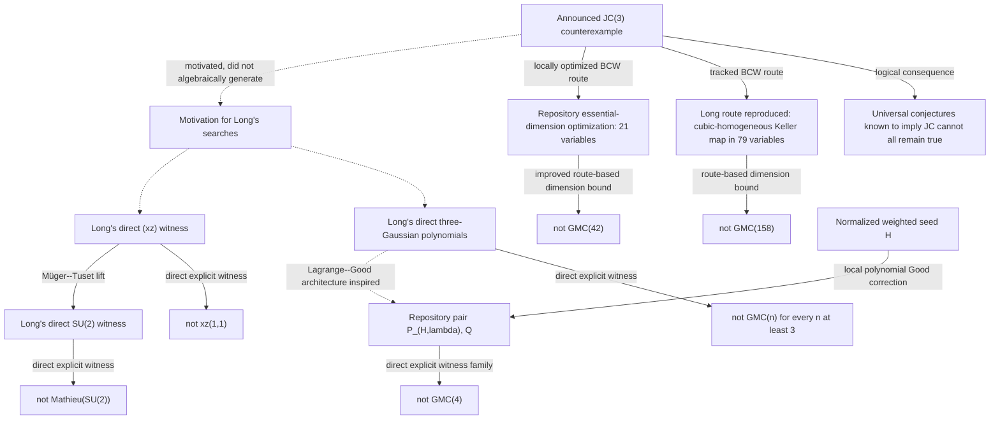

# External consequences and provenance

This note separates consequences discovered after the announced
three-dimensional Jacobian counterexample from the repository's internal
marked-root and boundary programme.  It records exact formulas where they can
be reproduced locally, but local reproduction is neither authorship nor peer
review.

The evidence labels used below have fixed meanings.

| Label | Meaning |
|---|---|
| **Logical consequence** | A one-way implication is applied, usually by contraposition. |
| **Route-based dimension bound** | A fixed construction is tracked through dimension-changing reductions; it need not produce a direct witness. |
| **Direct explicit witness** | Displayed formulas prove the claimed failure without passing through the announced Keller map. |
| **Independent external result** | The result is authored outside this repository. |
| **Locally reproduced identity** | A repository script checks the displayed algebra exactly; this is not external review. |

## Consequence and provenance graph

The solid arrows are logical or constructive implications.  The dotted arrows
record motivation only.  In particular, the graph does **not** contain arrows
from the marked-root coordinates to Long's direct witness polynomials.
The weighted-seed branch is a later repository construction, not an external
result and not a reverse provenance arrow into Long's work.

## Christopher D. Long: Gaussian moments

Christopher D. Long, *Small Counterexamples to the Gaussian Moments
Conjecture*, [arXiv:2607.18186v1](https://arxiv.org/abs/2607.18186), submitted
20 July 2026 at 17:24:43 UTC, is an **independent external result**.  It keeps
three different provenance levels separate.

1. The announced JC(3) counterexample motivated the search.
2. Tracking that map through a conservative Bass--Connell--Wright reduction
   gives a cubic-homogeneous noninvertible Keller map in 79 variables.  The
   fixed-dimensional Derksen--van den Essen--Zhao implication then gives the
   **route-based dimension bound** `not GMC(158)`.  The last step is
   nonconstructive and supplies no explicit Gaussian pair.
   A later repository common-factor optimization reaches dimension 16.  Exact
   rank compression of its cubic output then homogenizes in 24 variables;
   quotienting the two-dimensional constant Jacobian kernel gives a
   22-variable cubic-homogeneous collision.  A later 17-dimensional trace of
   cubic-output rank six homogenizes in 24 variables and has a
   three-dimensional constant-kernel quotient in 21 variables, improving this
   local route bound to `not GMC(42)`.  That improvement is
   not attributed to Long.
3. Long's direct three-variable pair independently gives the strictly stronger
   failure of `GMC(n)` for every `n >= 3`.  The paper states that no coordinate,
   term, or algebraic feature of the announced JC map was used to construct
   this pair.

For independent standard real Gaussians `X_1,X_2,T`, set

\[
 Z=\frac{X_1+iX_2}{\sqrt2},\qquad
 W=\frac{X_1-iX_2}{\sqrt2}.
\]

Long's exact direct witness is

\[
 \begin{aligned}
 P&=(1+Z)\left(W-\frac12(2+Z)T^2\right)\\
  &=W+WZ-T^2-\frac32ZT^2-\frac12Z^2T^2,
 \qquad Q=Z.
 \end{aligned}
\]

The paper proves, for every polynomial `A(z)` and every `m>=1`,

\[
 \mathbb E\!\left(A(Z)P^m\right)
 =m!\,[z^m]A(z)(1+z)^{m-1}.
\]

Taking `A=1,z` gives

\[
 \mathbb E(P^m)=0,
 \qquad
 \mathbb E(QP^m)=m!.
\]

The normalization is important: the three underlying real Gaussians have mean
zero and variance one, so

\[
 \mathbb E(W^aZ^b)=\delta_{ab}a!,
 \qquad
 \mathbb E(T^{2k})=\frac{(2k)!}{2^k k!}.
\]

The dependency-free checker
[`verify_long_gaussian_moments.py`](../scripts/verify_long_gaussian_moments.py)
performs exact Wick contractions through `m=10`, checks the master
coefficient identity on a monomial basis through `m=14`, and checks the
formal central-binomial identity through degree 20.  These are **locally
reproduced identities** and bounded regressions; the paper's displayed formal
series argument is the general all-`m` proof.

## Christopher D. Long: the `(xz)` and `SU(2)` Mathieu conjectures

Christopher D. Long, *Counterexamples to the (xz)-Conjecture and the Mathieu
Conjecture for (SU(2))*,
[arXiv:2607.19012v1](https://arxiv.org/abs/2607.19012), submitted 21 July 2026,
at 11:54:10 UTC, is a second **independent external result**.  Its direct
`(xz)` witness is

\[
 f(x,z)=(1-z^{-1})((1-x)+xz).
\]

For

\[
 \mathcal I(h)=\int_0^1\operatorname{CT}_z h(x,z)\,dx,
\]

the paper proves

\[
 \mathcal I(f^n)=0,
 \qquad
 \mathcal I(z^{-1}f^n)=\frac{(-1)^{n-1}}{n+1}\ne0.
\]

The cancellation is the exact beta/binomial identity

\[
 \binom nk\int_0^1x^k(1-x)^{n-k}\,dx=\frac1{n+1}.
\]

After expanding `((1-x)+xz)^n`, every coefficient of
`1+z+...+z^n` is therefore `1/(n+1)`.  The pure constant term is

\[
 \frac1{n+1}\sum_{j=0}^n(-1)^j\binom nj=0,
\]

whereas multiplication by `z^{-1}` leaves

\[
 \frac1{n+1}\sum_{j=0}^{n-1}(-1)^j\binom nj
 =\frac{(-1)^{n-1}}{n+1}.
\]

For `g` with coordinate matrix
\(\left(\begin{smallmatrix}a&c\\b&d\end{smallmatrix}\right)\in SU(2)\), Long
also gives

\[
 F=(1+c)(ad+b),\qquad G=-c,
\]

with the analogous normalized Haar-integral identities

\[
 \int_{SU(2)}F^n\,dg=0,
 \qquad
 \int_{SU(2)}GF^n\,dg=\frac{(-1)^{n-1}}{n+1}.
\]

The lift uses Müger and Tuset, *The Mathieu conjecture for `SU(2)` reduced to
an abelian conjecture*, Indagationes Mathematicae 35 (2024), 114--118,
[Lemma 2.1](https://doi.org/10.1016/j.indag.2023.10.001).  In the coordinate
order `(a,b,c,d)`, their integration map is

\[
 \beta(z_1,z_2,x)=((1-x)z_2,xz_1,-z_1^{-1},z_2^{-1}).
\]

It sends

\[
 F\longmapsto(1-z_1^{-1})((1-x)+xz_1),
 \qquad G\longmapsto z_1^{-1}.
\]

The dependency-free checker
[`verify_long_xz_mathieu.py`](../scripts/verify_long_xz_mathieu.py) checks the
beta/binomial identity exactly in a bounded range, expands both
Laurent moments exactly through `n=15`, verifies the displayed substitution,
and checks the monomial right side of the Müger--Tuset formula in degrees zero
through four.  The companion
[`verify_long_su2_haar.py`](../scripts/verify_long_su2_haar.py) identifies
`SU(2)` with the unit three-sphere, proves left invariance of normalized
surface measure, and computes the exact Hopf-coordinate density.  Together
with the monomial calculation, this is now a complete local proof of the
integration formula and the `SU(2)` identities.  The full argument is written
in the [local reproduction note](LONG_SU2_AND_BCW_REPRODUCTIONS.md).

Both preprints are authored by Long and disclose AI assistance in discovery,
checking, and drafting.  This repository follows the papers' authorship while
preserving those disclosures as part of the source provenance; its local
reproductions do not transfer authorship to this project.

The logical direction matters.  Long's explicit witnesses prove failures of
`xz(1,1)` and the Mathieu conjecture for `SU(2)`.  Failure of the latter does
not imply failure of JC(2): the relevant known implication runs from a
universal Mathieu statement toward a Jacobian statement, not conversely.
These direct witnesses were motivated by JC(3), not extracted from the
repository's marked-root map.

## Exact comparison of the announced JC normalization

The determinant-one map written in Long's BCW discussion is not merely a map
with the same degree or fiber cardinality as the repository's foundational
map.  It is an exact diagonal left--right normalization.

Let `F` denote the repository presentation

\[
 \begin{aligned}
 F_1&=(1+xy)^3z+y^2(1+xy)(4+3xy),\\
 F_2&=y+3x(1+xy)^2z+3xy^2(4+3xy),\\
 F_3&=2x-3x^2y-x^3z,
 \end{aligned}
 \qquad \det JF=-2.
\]

Let `L` be Long's determinant-one presentation.  Then exactly

\[
 L=T\circ F\circ S,
 \qquad
 S=\operatorname{diag}(1,2,2),
 \qquad
 T=\operatorname{diag}\!\left(\frac12,\frac12,-\frac12\right).
\]

Thus

\[
 \begin{aligned}
 L_1&=(1+2xy)^3z+4y^2(1+2xy)(2+3xy),\\
 L_2&=y+3x(1+2xy)^2z+12xy^2(2+3xy),\\
 L_3&=-x+3x^2y+x^3z,
 \end{aligned}
\]

and `det JL=1`.  The three source points

\[
 (0,0,-1/8),\quad(1,-3/4,13/4),\quad(-1,3/4,13/4)
\]

all map to `(-1/8,0,0)`.  This is verified by
[`verify_long_foundational_normalization.py`](../scripts/verify_long_foundational_normalization.py).
It establishes a verified scalar-coordinate normalization, not a new
provenance claim about Long's direct consequence witnesses.

The remainder of Long's conservative route is also reproduced exactly.  A
balanced BCW implementation performs 18 explicit stable degree-lowering
steps, reaches a degree-three map in 39 variables, and then constructs a
79-variable cubic-homogeneous Keller map with a transported three-point
collision.  The [complete proof and reproduction](LONG_SU2_AND_BCW_REPRODUCTIONS.md)
includes a serialized artifact and independent replay.  The
[fixed-dimensional proof](FIXED_GMC_SIC_PROOF.md) also reproduces the
DVEZ/Zhao implication needed to deduce `not GMC(158)`, while retaining their
authorship and the nonconstructive status of that final Gaussian step.

The same note now records a separate repository optimization.  Exposed factor
outputs are reused across elementary target shears, including five
zero-stabilization cancellations.  The exact trace introduces 13 rather than
36 variables, reaches degree three in dimension 16, and homogenizes to a
24-variable cubic map.  Its exact constant-kernel quotient gives a
22-variable cubic map.  A different 17-dimensional trace gives a
21-variable essential quotient.  The sparse artifacts and dependency-free
replays certify the improved nonexplicit consequence `not GMC(42)`.  No minimality is claimed,
and Long's 79-variable route remains the provenance-faithful reproduction of
the paper.

## Rank-two Poisson and `DC(4)`: independent closure, provenance open

A supplied abstract announces four polynomials

\[
 (R,T,D,S)\in\mathbb Q[x,q,p,z],\qquad R=x(2-3xq),
\]

forming two canonical Poisson pairs, a nonautomorphic exact symplectic map of
\(\mathbb A^4\), and a separate Weyl-algebra counterexample.  As of 22 July
2026, exact-phrase and formula searches, arXiv metadata queries, and inspection
of the public Omniscience Project paper index did not locate an identifiable
public paper, author list, version, or stable URL.  The separately published
Omniscience/Pickhardt `A_3` paper is not the supplied rank-two manuscript.  The
abstract omits the formulas for `T,D,S`.  Consequently its construction,
term-by-term outputs, Hamiltonian-dual appendix, and exact dependency on the
foundational map still cannot be audited or attributed.

One provenance fingerprint is now exact.  After the polynomial source
automorphism

\[
 X=x,\quad Z=3x^2p+(2-6xq)z,\quad
 Y=q-xZ/3,
\]

the foundational third output is precisely
`F_3(X,Y,Z)=x(2-3xq)=R`.  This is strong, verified evidence of derivation from
the foundational map, although only the missing source can establish how the
actual `T,D,S` are built.  Moreover, the naive choices
`S=F_1/2`, `T=F_2` satisfy the first canonical-pair identities but admit no
polynomial `D` completing all six brackets.  The repository proves this by an
exact localized differential obstruction.

That obstruction has now led to a separate local construction.  For the
one-parameter shear `Z -> Z+cQ^2`, the complete negative-power part of the
forced primitive is proportional to `c+9`; the unique pole-free value is
`c=-9`.  It produces compact exact formulas for all four outputs.  The
repository independently proves all six brackets, determinant one, generic
degree three, exact symplecticity, and a complete rational three-point fiber.
The resulting four-dimensional map is polynomially right--left equivalent to
the foundational map times an identity.  These statements and formulas are
in the
[quadratic-ladder and Poisson note](QUADRATIC_LADDER_AND_POISSON_AUDIT.md).

The `A_2/A_4` terminology can also be narrowed.  Four Poisson coordinates
have the symbol size of `A_2`; the abstract's separate use of the four outputs
and four Hamiltonian duals instead has eight generators and naturally lands
in `A_4`, as an inverse-Jacobian/cotangent construction would.  Applying the
repository's general inverse-Jacobian theorem to the independent
four-variable map does give an injective non-surjective endomorphism of
`A_4`.  The external appendix is still required to decide whether that is
also its construction.

The repository's general cotangent lift starts from an arbitrary
three-dimensional Keller map and gives an exact symplectic map of
`A^6` and a Weyl endomorphism of `A_3`.  The independent rank-two result is
sharper on the symplectic side: special foundational geometry completes a map
already in `A^4`.  Its `A_4` Weyl consequence then uses the general
inverse-Jacobian construction on that four-variable base map.

The local formulas and consequences are now repository theorems with exact
certificates.  They do not promote the supplied abstract to a sourced result.
Until its missing source and outputs are available, that item remains an
**external announced manuscript under provenance audit**, not an attributed
Long result and not an external review.  Independent reproducibility is
evidence for the mathematics, not evidence of provenance or priority.

## What these papers do and do not establish here

JC(3) has generated two distinct bodies of work:

- **internal geometry:** the repository's marked-root, boundary,
  decorated-normalization, and stable-moduli programme;
- **external consequences:** Long's direct GMC, `(xz)`, and `SU(2)`
  counterexamples and his tracked GMC(158) route, together with the
  repository's later shared-factor, rank-compressed, and constant-kernel
  improvement of that route to GMC(42).

The existence of explicit consequence-level counterexamples supports studying
the JC(3) map as a generator of new mathematics.  It does not make every
downstream witness a transformation of that map.  Long's two papers neither
validate nor externally review the repository's Hessian/Fitting-divisor,
decorated-normalization, or positive-dimensional symplectic-moduli theorems.

Likewise, JC(3) exposes a concrete marked-point mechanism.  The current
dimension barrier excludes that exact mechanism in dimension two, not
arbitrary JC(2) counterexamples.

## Forward research trajectories

1. **Systematic consequence mining.**  Build a directed graph of conjectures
   known to imply JC and record which fixed-dimensional failures follow by
   contraposition, keeping route bounds separate from direct witnesses.
2. **Weighted-seed Gaussian families and equivalence.**  The
   [four-real-Gaussian bridge](WEIGHTED_GAUSSIAN_BRIDGE.md) now turns every
   nonconstant normalized seed into an explicit witness family by an exact
   polynomial determinant correction.  Its
   [formal Gaussian--Lagrange lemma](FORMAL_GAUSSIAN_LAGRANGE_LEMMA.md), now
   proved with arbitrary constant terms and a coefficientwise residue change,
   is the priority target for external specialist review.  Determine when two
   resulting pairs are equivalent and whether a different correction can
   descend uniformly to three real variables.  The raw mixed-moment question
   is now settled internally: the full sequence recovers `1+lambda*H`
   exactly—and on `H'(1)=-1` recovers both `lambda` and `H`—so seed moduli
   survive as exact moment fingerprints, without yet implying inequivalence
   under transformations of Gaussian variables.
3. **Minimal dimensions.**  Determine why both the simple marked-point
   architecture and Long's direct GMC architecture begin naturally in
   dimension three.  Study GMC(2) without treating it as equivalent to JC(2).
4. **Symplectic dimension descent and families.**  The foundational map now
   has an intrinsic four-dimensional rank-two completion.  Determine which
   weighted seeds admit analogous pole-free flux corrections, whether their
   stable moduli survive in dimension four, and compare the local formulas
   with the external manuscript only after its full source is available.
5. **Quantization.**  Compare inverse-Jacobian Weyl lifts,
   Hamiltonian-dual constructions, and associated-graded maps.  Keep ordinary
   Weyl equivalence distinct from filtration-preserving equivalence.
6. **Cancellation taxonomy.**  Compare polynomial Jacobian cancellation in
   the foundational map, Long's Lagrange/determinant cancellation, and the
   beta/binomial cancellation in the `(xz)` example.
7. **Explicit families and moduli.**  Compare Long's minimal-support isolated
   witnesses with the new weighted-seed families.  The mixed-moment sequence
   is already an injective seed fingerprint; determine which functions of it
   descend to invariants for natural Gaussian-equivalence groups and whether
   the seed's decorated-normalization moduli remain visible after quotienting.
8. **Cross-stratum generator rigidity.**  The root-one sheet is intrinsically
   distinguished inside the affine source over `Z_0`, but it is disjoint from
   the ramification divisor.  Determine whether an isomorphism of normalized
   incidence covers preserving the regular-reconstruction opens must identify
   the primitive root generators compatibly across those strata.  A positive
   theorem would turn the conditional argument in the
   [decorated-normalization note](DECORATED_NORMALIZATION_INVARIANT.md) into
   `F_H stable-equivalent F_G => H=G` for normalized boundary-clean seeds.
9. **Rank-aware BCW circuit minimization.**  The reusable-factor certificate
   lowers the conservative route from 36 to 13 introduced degree-reduction
   variables.  Rank-compressed homogenization turns its exact cubic-output
   rank seven into final dimension `4+s+k=24`.  Future SAT, MILP, beam, or
   circuit searches should therefore minimize `s+rank(C)`, not `s` alone,
   while tracking exposed-factor lifetime, component conflicts, polynomial
   factor reuse, multi-term cancellations, and zero-cost target shears.
   Treat 24 as a certified upper bound, not a minimum.  A separate stronger
   target is an equivalent `K=X+Q+C` with `det(I+sJQ+tJC)=1`; that would avoid
   doubling and give a 17-variable homogeneous map and `not GMC(34)`.
