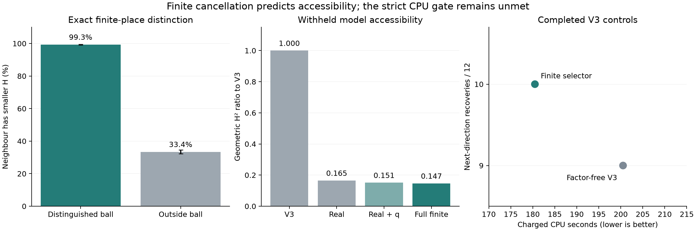

# Finite-place cancellation and withheld-point accessibility

Finite cancellation is systematic and supplies usable information before a
target point is known. The useful object is a local residue distribution of
the primitive pair `(N,D)`, conditioned on the quartic `q` being square. An
absolute large gcd is not itself a cheap-coordinate criterion.

The completed experiment covers **6,285 exceptional-point observations,
1,962 curve/generic-basis banks and 1,961 distinct j groups**. All 491 current
registry endpoints join to documented generic subgroups; full-cohort packets
add gains below the registry cutoff. Four public record controls are included.
There are 75,272 exact signed point/model evaluations on 11,741 models. The
[census](../../artifacts/generated-results/elliptic-curves/finite_cancellation_predictor_v1/census.json)
binds every source and records two stale interim witness hashes. Those old
hashes were preserved; current generic subsets were checked against the
frozen independent point lists without retagging their certificates.

On twelve withheld-curve V3 controls the fitted policy recovered 10 next
directions, versus 9 for factor-free V3, in 180.488128 versus 200.515316 charged
CPU seconds. The **9.987859% saving misses the predeclared 10% CPU gate**.
This is a positive bounded observation, not evidence for replacing the default
V3 policy. The exploratory paired-case bootstrap CPU-ratio interval is
`[0.6748,1.0748]`. No extra timing runs were used to move the result across
the cutoff. A clean claim of non-predictiveness would also contradict the data.

The [subsequent clean 41-curve validation](FINITE_CANCELLATION_VALIDATION_2026-09-14.md)
fails its CPU/recovery gates, including on M24–M25 subgroups. It corrects the
q-only attribution boundary and proves a derivative/squareclass corollary.
The original measurements and conditional height signal below are preserved.

The authority entry is `EC-FINITE-CANCELLATION-PREDICTOR-20260914`.
The compact [summary and file hashes](../../artifacts/generated-results/elliptic-curves/finite_cancellation_predictor_v1/summary.json)
link the primary protocol, full corpus, predictions, exact replays and CPU
receipts. No worst-case `C/L` constant was optimized.



## The exact local law

Write the short curve as `y²=x³+A*x+B` and the known anchor as `Q=(a,b)`.
In the raw slope coordinate `(u:v)`, the existing pointed construction has

\[
\begin{aligned}
D&=u^4-6a u^2v^2-8buv^3-(3a^2+4A)v^4,\\
N&=a u^4+4b u^3v+(6a^2+4A)u^2v^2+4abuv^3+(a^3+4B)v^4.
\end{aligned}
\]

After the chart substitution, clear denominators **jointly** and divide the
common coefficient content. For primitive `(m,n)`, these primitive integral
forms give `x(2P-Q)=N(m,n)/D(m,n)`. Set

\[
g=\gcd(N(m,n),D(m,n)),\qquad
S=\frac{\max(|N(m,n)|,|D(m,n)|)}{H(m:n)^4}.
\]

Then, exactly,

\[
H(m:n)^4=H_x(2P-Q)\,g/S.
\]

At a fixed residual point and fixed real factor, larger `g` increases the
parameter height. The observed cancellation must be compared to the real
factor and model normalization. It cannot be treated as an isolated reward.

**Degree-p neighbour lemma.** Let `T` be an integral 2-by-2 matrix with
`|det(T)|=p`, and let `c` be the common coefficient content of `(N∘T,D∘T)`.
If `(N,D)` is jointly primitive, then `c=p^e`, with `0≤e≤4`. Put
`(N',D')=(N∘T,D∘T)/p^e`. For primitive new coordinates `z`, write
`Tz=p^δ w` with `w` primitive. Then `δ∈{0,1}` and

\[
\boxed{g'(z)/g(w)=p^{4\delta-e}.}
\]

Indeed, `T` is invertible over `Z_l` for every `l≠p`, so no such prime divides
the coefficient content or the coordinate gcd. The adjugate of `T` proves
that the coordinate gcd divides `p`; applying its fourth symmetric power
proves `c|p^4`. Homogeneity gives the displayed formula. Thus **every other
finite-place contribution cancels exactly in the model comparison**, without
factoring a discriminant or a resultant.

For the constructed neighbour `T=[[p,r],[0,1]] U`, with integral unimodular
reduction `U`, the old-coordinate ball `m≡r*n (mod p)` has `δ=0`;
its complement has `δ=1`. The two possible ratios are therefore `p^-e`
and `p^(4-e)`. This completely describes the finite part of the height
change; the remaining change is the measured real factor `S/S'`.

The [state certificate](../../artifacts/generated-results/elliptic-curves/finite_cancellation_predictor_v1/neighbour_states.json)
checks this identity on every one of 7,817 neighbours and every corresponding
signed target. Their content exponents are:

| `e` | Neighbours | In the distinguished ball | Outside |
|---|---:|---|---|
| 2 | 4,472 | `g'/g=p^-2` | `g'/g=p²` |
| 3 | 562 | `g'/g=p^-3` | `g'/g=p` |
| 4 | 2,783 | `g'/g=p^-4` | `g'/g=1` |

The neighbour has smaller literal parameter height in 99.31% of observations
inside its distinguished ball, versus 33.37% outside, with equal weight per
j group. These are measured conditional frequencies, not a theorem that a
local ball contains an independent rational point.

## Predicting the ball without the point

Primitive projective residue balls at depth `k` have mass
`1/((p+1)*p^(k-1))`. The implementation partitions both `(t:1)` and `(1:p*t)`.
Each retained leaf certifies a constant `v_p(g)`, a square/nonsquare decision
for `q`, or explicit unresolved mass. It includes the square-unit condition
modulo 8 at 2. The fixed panel is all primes through 31, depth 4 at odd primes,
depth 8 at 2, with a 4,096-node cap per prime. Unresolved leaves are not counted
as soluble or insoluble. They contain 2.60% of evaluated target locations.

Uniformly sampling soluble slopes is a poor reference distribution. For
`Y²+Q(t)Y=P(t)`, the regular differential is proportional to
`dt/(2Y+Q(t))=dt/sqrt(q(t))`. On a leaf with constant `v_p(q)=v`, its local
differential mass is consequently proportional to

\[
\text{projective mass}\;p^{v/2}.
\]

Normalize these weights on the resolved soluble leaves. This is a
target-blind local reference measure, not an assumption that the searched
rational points are independently sampled from all of `E(Q_p)`.

Against the uniform soluble null, known points have mean cancellation
percentile 0.6004 instead of 0.5. The differential-weighted value is 0.4847:
the apparently excessive cancellation largely disappears after accounting
for `q`. The distinguished-ball prior is underpredicted by 44.44 percentage
points under the uniform soluble null; the differential prior overpredicts
by only 2.42 points. Both comparisons cluster by j group.

The baseline median `log2(g)` is 31.7185. All 30,858 distinct observed gcds
were subsequently factored exactly; the 353 remaining cofactors after the
small-prime panel were all below `2^64` and were independently checked for
primality by PARI and SymPy. These retrospective factors are excluded from
every selector input. The [full decomposition](../../artifacts/generated-results/elliptic-curves/finite_cancellation_predictor_v1/prime_decomposition.json)
also retains the twelve original Curve302 model diagnostics. For the three
original factor-free winning models:

| Control | Actual `g` | `log2(C/g)` from the retained bound |
|---|---|---:|
| Curve302 M27 | `2^8*5²*11²*23²` | 73.6374 |
| Curve302 M29 | `2^12*3^4*7²*11²` | 69.4771 |
| Curve302 M30 | `2^8*3^8*7²*41²` | 63.7620 |

Large absolute gcds coexist with enormous unused worst-case slack. The
experiment measures their distributions and exact model changes, leaving
the old coverage bounds unchanged.

## Withheld model test

The [primary protocol](../../artifacts/generated-results/elliptic-curves/finite_cancellation_predictor_v1/protocol.json)
was frozen before target measurement. Each census bank uses its first two
documented generic points as anchors. The model bank is factor-free V3 plus
the first two distinct integral neighbours in increasing prime/root order.
It performs no global minimization or discriminant factorization.

Features use only `(N,D,q)`: two local cancellation expectations, soluble and
censored masses, coefficient size, and a fixed real boundary-grid average
of `log2(S)`. The grid average is a feature, not a certified real bound.
Ridge regression with fixed penalty 10 predicts the height difference from
the baseline. Five j-hash folds and leave-one-family-out checks exclude
whole curves; the duplicate j group stays together even across families.
Curve302 is development-only. Both signs of every literal point are
evaluated, and the smaller height supplies the direction label.

| Selector | Geometric `H²` ratio to factor-free | Scope |
|---|---:|---|
| Fitted real features | 0.165381 | Primary five-fold test |
| Fitted real and finite features | 0.146781 | Primary five-fold test |
| Fitted real and finite features | 0.146532 | Whole-family holdout |
| Real plus `q` features, omitting gcd expectations | 0.151442 | Post-primary attribution check |
| Literal best model oracle | 0.081273 | Diagnostic ceiling only |

The primary finite increment over fitted real features is 11.25%, with a
paired j-bootstrap ratio interval `[0.86335,0.91400]`; the family holdout
gives 11.46%. The separately labelled, post-primary `q` ablation leaves an
additional 3.08% contribution from the gcd expectations, with ratio interval
`[0.95453,0.98452]`. That attribution check did not change the selector,
gate, CPU cases or training penalty.

That ablation retained the original joint `(N,D,q)` residue tree, so its
soluble and unresolved masses could still depend on gcd constancy. It isolates
the explicit gcd expectations within that implementation. The
[separate validation](FINITE_CANCELLATION_VALIDATION_2026-09-14.md) constructs
a q-only tree to test the additional cancellation information and its cost.

These are literal representative heights. Their baseline median is about
95 parameter bits, and only two direction/anchor units fit `H=125000`.
The census therefore cannot turn an `H²` proxy into a CPU claim. Different
certified packets can contain dependent unions of representatives; neither
point signs nor anchors are independent statistical replicates. Historic
discovery and publication selection also remain present.

## New CPU execution on retained V3 banks

The [separate CPU protocol](../../artifacts/generated-results/elliptic-curves/finite_cancellation_predictor_v1/cpu/protocol.json)
selected two lowest j hashes in each of six R17 families among available
pre-acquisition V3 banks with a certified larger endpoint. All 12 j groups
were excluded from training. Search code used the known M18–M20 subgroup,
retained centre order and frozen coefficients; it never read final points or
target coordinates. Input rows also retain the larger endpoint rank as
eligibility metadata. The worker does not access that field; this is
code-level separation, not a claim that the input file contains no labels.

Each arm used `H=125000`, at most 48 centres, a 40-CPU-second allowance and a
5-second point-call wall limit. It stopped after its first newly certified
independent direction. Outer process receipts include interpreter startup,
finite tables, map construction, all discarded models and local features,
point calls and the producer's standalone rank proof. Cached landscapes
were common inputs. Offline training cost 7.50 CPU seconds is recorded
separately. Arm order alternated by case; all 24 arms completed without
timeouts or infrastructure failure.

| Measured outcome | Factor-free V3 | Finite selector |
|---|---:|---:|
| Independent next-direction recoveries | 9/12 | 10/12 |
| Cases containing a literal withheld point in the returned cloud | 7/12 | 9/12 |
| Point invocations | 290 | 237 |
| Charged CPU seconds | 200.515316 | 180.488128 |

The independent checker reconstructs every selected feature vector and map,
replays every point transcript, and proves all 19 enlarged subgroups using
both the portable implementation and complete Sage cosets `E(F_p)/2E(F_p)`.
The [paired table](../../artifacts/generated-results/elliptic-curves/finite_cancellation_predictor_v1/cpu/comparison.csv)
retains successes, literal hits, calls and CPU per case. No rank upper bound,
record, or equality of the enlarged subgroup with a full Mordell–Weil group
is inferred. Literal recovery and a different independent representative
are counted separately.

The selector increases observed direction recoveries per CPU by 23.44%, but
the strict aggregate-time gate remains false. There is only one discordant
next-direction outcome. The data support a small experimental policy and
further independently frozen validation, not a reliable population speedup
or transfer to the stalled M27+ searches. No campaign is scheduled.

## Reuse and replay

The opt-in mapping policy is
[`lean_finite_cancellation_pari_mapping.sage`](../cas/lean_finite_cancellation_pari_mapping.sage),
with frozen [coefficients and source bindings](../data/finite_cancellation_policy_v1.json).
The existing bounded map worker accepts `policy: "finite_cancellation"` in
its ordinary equation/known-points/centre input. It emits an exact map and
the selected features and scores. Factor-free remains the default.

From the repository root, the arithmetic checks are:

```sh
python3 research/elliptic-curves/cas/verify_finite_cancellation.py
sage -python research/elliptic-curves/cas/verify_finite_cancellation_cpu.sage
sage -python -m pytest -q research/elliptic-curves/tests/test_finite_cancellation_features.py
```

The first replay checked 7,616,068 leaves and 50,132 all-other-prime equality
comparisons in 271 CPU seconds. The CPU/selector/rank replay took 35 seconds;
the five small regressions passed. They do not repeat point searches.
The source-locked scripts and full input hashes retain the generation and
CPU-execution recipes. Do not treat the new option as authorization to
restart older campaigns.

One replay issue is explicitly preserved: the original CPU preparation hash
included unretained timing fields, so it cannot be reconstructed as a whole
object. The corrected checker instead reconstructs every retained feature
vector, score and selected map exactly; it does not retag that hash. The
new optional mapper hashes arithmetic separately from timing. Four early
implementation-pilot cases and one worker smoke test remain separate from
all primary statistics and official outer CPU receipts.

PARI's [official model and point-search documentation](https://pari.math.u-bordeaux.fr/dochtml/ref/Hyperelliptic_curves.html)
describes the integral `hyperellred` transformation and finite rational
coordinate boxes used by the unchanged point backend. The local law above
is proved directly and does not rely on a statistical height heuristic.
