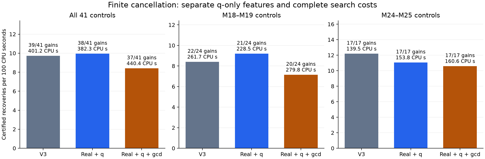

# Separate q-only information from cancellation in a withheld CPU comparison

**Both fitted policies fail the frozen 41-curve validation.** Factor-free V3
recovers 39 directions in 401.20 CPU seconds; q-only recovers 38 in 382.27;
the full cancellation policy recovers 37 in 440.39. The full policy has
13.57% fewer recoveries per CPU, with the conditional paired interval entirely
below parity. All 1,605 point calls and all 114 positive rank certificates
replay. Factor-free remains the default.

The authority entries are `EC-FINITE-CANCELLATION-VALIDATION-20260914` and
`EC-POINTED-CANCELLATION-HESSIAN-20260914`.

This is the separately frozen continuation of the
[finite-cancellation predictor study](FINITE_CANCELLATION_PREDICTOR_2026-09-14.md).
It tests whether the finite information earns its preparation cost, including
on larger starting subgroups. The original twelve-case result and its failed
strict CPU gate remain unchanged.

The experiment has 41 distinct held-out curves: 24 starting at M18–M19 and
17 at M24–M25. Every starting basis is an explicit subset, up to signs after
exact model transport, of a separately certified larger subgroup. Portable
seed signatures and independent Sage quotient arithmetic verify all inputs
and larger endpoints. The endpoints are known controls, not new discoveries.

## Why a clean ablation is necessary

The earlier attribution diagnostic omitted the two explicit gcd expectations
but retained a joint `(N,D,q)` residue tree. That tree refined a soluble cell
until the gcd valuation was constant. Its unresolved mass and soluble mass
could therefore depend on `N,D`. The reported 3.08% improvement is the
increment from explicit gcd expectations within that implementation; it
does not isolate every source of gcd information from a purely q-based policy.

The new implementation separates the two operations. A function whose only
polynomial input is `q` partitions both projective charts and certifies square,
nonsquare or unresolved cells. Both fitted arms use exactly the same real
features and q-only masses. The full arm additionally refines the soluble
q cells for constancy of `min(v_p(N),v_p(D))`, retaining any further unresolved
mass. This refinement cannot change the common q features.

Both operations keep the original prime panel through 31, depth eight at 2
and depth four at odd primes. Each prime's recursion stops further refinement
after 4,096 visited nodes; already opened sibling branches still receive a
terminal leaf. Every retained partition covers the full projective line.
Square-unit tests at 2 use modulus eight. The full arm computes uniform and
`p^(v_p(q)/2)`-weighted cancellation expectations only on resolved soluble
cells. No assertion about the distribution of global rational points follows.

This is a successor feature definition with a new fit. It does not silently
replace the fitted V1 policy or reinterpret its original CPU measurements.

## An exact derivative corollary

The repository's established
[Hessian covering map](DET1092_RECIPROCAL_QUARTIC_AND_COVER_CLASS_2026-09-09.md)
also gives a direct description of the cancellation. This is an application
of that covariant identity, not a new covering construction.

Write the binary Hessian as
`Hess(f)=f_uu*f_vv-f_uv^2`. In the raw pointed coordinate, substitution of
`b^2=a^3+A*a+B` gives `Hess(D)=-144*N`. If a retained horizontal matrix `M`
and positive square factor `rho` satisfy `D∘M=rho*q`, the Hessian chain rule
gives

\[
\frac{N\circ M}{D\circ M}
=-\mu\frac{\operatorname{Hess}(q)}q,
\qquad \mu=\frac{\rho}{144\det(M)^2}=\frac{\alpha}{\beta}.
\]

Here `alpha,beta` are relatively prime positive squares. If
`h=content(-alpha*Hess(q),beta*q)`, joint primitive normalization therefore
gives **exactly**

\[
(N_{\rm prim},D_{\rm prim})
=\frac1h\bigl(-\alpha\operatorname{Hess}(q),\ \beta q\bigr).
\]

On the affine projective chart the polynomial identity is

\[
\operatorname{Hess}(q)(t,1)=12q(t)q''(t)-9q'(t)^2.
\]

Consequently, for `p` not dividing `6*alpha*beta`, a primitive address gives

\[
\boxed{v_p(g)=\min\{v_p(q),\,2v_p(q')\}-v_p(h).}
\]

Use `t=m/n` when `n` is a p-adic unit and the reversed quartic at `n/m`
otherwise. Unit powers from homogenization do not affect the valuations.
The proof is the ideal identity
`(q,Hess(q))=(q,9*q'^2)` in that integral local chart. In particular, when
`v_p(h)=0`, positive cancellation requires a multiple root of `q` modulo p.
The fixed exceptional primes remain outside this shortcut.

There is also a statement at **every** prime. On an integral short curve and
away from `D_prim=0`,

\[
\boxed{h\,g\text{ is a perfect square}.}
\]

Indeed `q(m,n)` is an integer square at a rational point, and `beta` is a
square. A rational x-coordinate on an integral short Weierstrass equation
has square denominator: if `v_p(x)<0`, the term `x^3` uniquely has smallest
valuation in `x^3+A*x+B=y^2`, forcing `v_p(x)` even. Thus
`D_prim/g=beta*q/(h*g)` is a square denominator, proving the assertion.
This fixes the squareclass of the gcd before the target is known; it does
not determine its magnitude or prove that a residue ball contains a new
independent direction.

The [corollary certificate](../../artifacts/generated-results/elliptic-curves/finite_cancellation_validation_v2/hessian-cancellation.json)
checks both universal polynomial identities, reconstructs all 11,741 retained
primitive pairs, verifies 677,448 derivative-valuation identities and checks
`h*g` is square on all 75,272 signed target/model observations. In this bank,
`mu` is always `1/144` or `1/576`, so the exceptional primes are just 2 and 3.
There are 562 models with nonsquare `h`; their gcds still have its fixed
squareclass. The strengthened check took 7.46 CPU seconds and also reconstructs each full
gcd, including exceptional and unprocessed primes. Its initial receipt is
preserved separately.

This identifies a possible cheaper way to compute cancellation features
from `q` and its derivatives. It was derived during the frozen benchmark
and does not alter either tested policy, its features, the analysis rule,
or the CPU roster. A faster implementation has not been benchmarked here.

## Roster and blinding

The [design](../../artifacts/generated-results/elliptic-curves/finite_cancellation_validation_v2/design.json)
was written before auditing retained banks. The audit considered 8,578 local
`landscape/selection.json` files and found 2,254 eligible banks on 812 distinct
j groups in the six declared R17 families. It required matching seed/basis
data, a retained independence proof, at least 16 centres, and a documented
larger endpoint. It found no eligible M27 bank. Missing inputs were not rebuilt.

Selection takes at most four curves per family in each of two fixed strata:
M18–M20 and M24–M27. Deep controls are chosen first, using the largest available
starting rank per j group and then lexical path order. Shallow controls use
lexical bank order. Within each family the lowest j hashes win; a j group is
used at most once. Unfilled deep slots stay unfilled. All twelve previous CPU
curves and Curve302 are excluded. The final
[roster](../../artifacts/generated-results/elliptic-curves/finite_cancellation_validation_v2/roster.json)
contains 21 M18, three M19, thirteen M24 and four M25 inputs.

One audit read hit Python's integer-string conversion limit. The retained
[resolution](../../artifacts/generated-results/elliptic-curves/finite_cancellation_validation_v2/audit-gap-resolution.json)
rereads that input with the conversion limit disabled and confirms that its
curve has no eligible endpoint in the declared panel. The original failure
receipt and frozen roster are preserved.

The fit excludes all 41 selected j groups and the thirteen prior development
groups. It uses 3,816 retained generic anchors, 35,926 model/target rows and
1,907 training j groups. Features and ridge penalty ten are fixed. The two
fits share the same rows and height-difference labels. Neither the historical
winning chart nor target height chooses a control or its centre order.

The worker input contains only the known equation, subgroup proof, centre
words and identifying metadata. Larger ranks and endpoint coordinates are
in a separate oracle file, opened only by eligibility/input checks and the
post-execution verifier. The full corpus has already informed development:
this is separation from fitting and from new CPU outcomes, not a pristine
external sample of curves.

## Execution and decision rule

The three policies are factor-free V3, real plus q-only features, and the same
features plus cancellation. They use identical retained centre orders,
`H=125000`, at most 48 centres and a 40-CPU-second search allowance per arm.
Point calls have a five-second wall limit; outer arms have a 90-second wall
limit and a 60-second process CPU safeguard. Each stops at its first newly
certified independent direction. The six permutations of arm order cycle
through the roster, with one arm running at a time.

Every outer receipt charges interpreter startup, seed verification, all
candidate models and discarded features, point calls, admission and the
producer's final independence proof. Common retained centre-bank creation
is outside this comparison. Offline training, input verification and the
independent post-execution replay are reported separately.

The primary outcome is certified recoveries per charged CPU, with literal
withheld-point hits reported separately. Each fitted arm must have at least
as many successes as factor-free, at least 10% higher recoveries per CPU,
and a paired stratified bootstrap 95% interval entirely above one. The
cancellation-specific comparison applies the same rule to full versus q-only.
Ten thousand bootstrap samples preserve the observed family/stratum cells.
Zero-success reference denominators leave the rate gate UNKNOWN. The old
10% aggregate-time gate is also reported separately; it is not substituted
for the new primary outcome after seeing results.

No extra cases, timing repeats or policy adjustments follow observed outcomes.
Failure of this bounded test is not a theorem that every finite-place feature
is useless. Success on these controls does not establish an M27+ gain, rank
upper bound, record, or universal population speedup.

## Results and replay

The complete [summary and hashes](../../artifacts/generated-results/elliptic-curves/finite_cancellation_validation_v2/summary.json)
and [paired table](../../artifacts/generated-results/elliptic-curves/finite_cancellation_validation_v2/comparison.csv)
retain every arm. All 123 arms finished normally: 114 certified a direction
and nine exhausted their retained bank. Every point call completed; there
were no point timeouts, map failures or worker failures.

| Measured outcome | Factor-free V3 | Real + q | Real + q + gcd |
|---|---:|---:|---:|
| Independent recoveries | 39/41 | 38/41 | 37/41 |
| Cases containing a literal withheld point | 35/41 | 32/41 | 31/41 |
| Point calls | 545 | 494 | 566 |
| Charged CPU seconds | 401.197551 | 382.267687 | 440.388142 |
| Recoveries/CPU relative to V3 | 1 | 1.02261 | 0.86429 |

The q-only policy's recoveries/CPU interval is `[0.88224,1.20397]`. The full
policy's interval is `[0.78504,0.93817]`; compared with q-only it is
`[0.69360,0.98904]`, with estimated ratio `0.84518`. Neither fitted arm
recovers a direction on a case where V3 fails. Q-only misses one V3 success;
the full arm misses two. All primary and original-style time gates fail.
These intervals are conditional paired bootstrap summaries for the declared
retained roster, not simultaneous confidence bounds or a population theorem.

The rank strata agree on the absence of a validated policy improvement:

| Starting subgroup | V3 gains / CPU seconds | Real + q | Real + q + gcd |
|---|---|---|---|
| M18–M19, 24 cases | 22 / 261.68 | 21 / 228.51 | 20 / 279.84 |
| M24–M25, 17 cases | 17 / 139.52 | 17 / 153.76 | 17 / 160.55 |

On the deeper controls, q-only costs 10.21% more and full cancellation
15.08% more for the same 17 recoveries. Their recoveries/CPU intervals versus
V3 are `[0.79346,0.97207]` and `[0.76979,0.94378]`. This supplies a negative
transfer result on these M24–M25 banks, with no extrapolation to M27+.

The full policy's loss is not all feature overhead. Its point backend alone
uses 342.93 CPU seconds versus V3's 328.05, and it makes 21 more point calls
while recovering two fewer directions. Map/feature preparation adds 29.07
CPU seconds versus 4.12. Q-only reduces backend time to 296.09 seconds but
adds 17.47 seconds of preparation and loses a success. Removing preparation
cost would not repair the full policy's recovery deficit in this experiment.



The independent training replay checks 14,817,426 residue leaves on 11,417
models and reconstructs both fits exactly. The execution replay checks
another 3,213,287 leaves, all point transcripts and all 114 enlarged subgroups
using both portable finite signatures and complete Sage cosets. It confirms
483 shared-centre comparisons with identical common real/q feature vectors.
The four small isolation/partition regressions pass.

Separate offline costs are 56.74 CPU seconds for the input preflight, 106.31
for fitting and feature preparation, 341.99 for the training replay and
199.11 for the output replay. These are not amortized into an asserted
production speedup. The Hessian check and its initial receipt are also
retained separately from timed arms.

**Decision.** Retain factor-free V3. The tested fitted policies are not
promoted or given a larger allowance. The derivative and squareclass laws
remain reusable mathematical information, and the earlier generic-anchor
height signal remains a scoped observation. Further work needs a separately
justified objective tied to actual new-direction recovery; cheaper feature
evaluation alone cannot fix the missed directions here. No additional
benchmark or production search is scheduled by this result.

The reusable implementation is
[`finite_cancellation_validation_features.py`](../cas/finite_cancellation_validation_features.py).
Replay commands, from the repository root, are:

```sh
python3 -m pytest -q research/elliptic-curves/tests/test_finite_cancellation_validation.py
sage -python research/elliptic-curves/cas/verify_finite_cancellation_validation.sage training
sage -python research/elliptic-curves/cas/verify_finite_cancellation_validation.sage cpu
sage -python research/elliptic-curves/cas/verify_pointed_cancellation_hessian.sage
```

The generation path is the separate audit, input preflight, excluded-curve fit,
protocol seal and sequential supervisor. Existing rosters and timed arms are
immutable; the supervisor resumes only unexecuted arms. Raw arithmetic and
point transcripts are retained under
`artifacts/local/elliptic-curves/finite-cancellation-validation-v2/`, while
compact protocols, input snapshots, comparisons and replay receipts live in
the generated-results directory. The byte-checked
[CPU replay archive](../../artifacts/generated-results/elliptic-curves/finite_cancellation_validation_v2/cpu-replay.tar.gz)
contains all 3,148 raw files, with a
[per-file manifest](../../artifacts/generated-results/elliptic-curves/finite_cancellation_validation_v2/cpu-replay-manifest.json).
If the raw directory is absent, explicitly extract this retained archive into
that directory before the CPU replay; this restores evidence and does not
regenerate a landscape or repeat a point search. No old stopped production
campaign is resumed.
